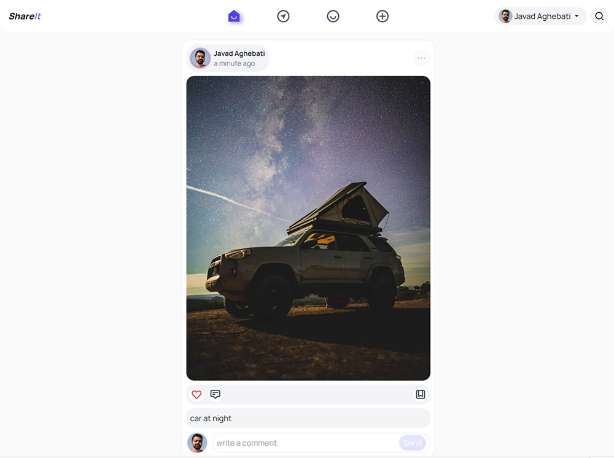

# Shareit social media app

  

## About

Shareit is a clone of famous social media apps . created using latest Next 13 as front and sanity,cloudinary as backend

## Features

- Upload Photo and Video
- Search user and tags
- Like , comment and save posts
- Follow people you know or unfllow them!

## Todo

since Next 13 app directory is in beta some features have to wait .

- [ ] Dark mode
- [ ] Transitions and loading

## Built With

- Nextjs
- Sanity
- Cloudinary
- Tailwind
- NextAuth
- React-Easy-Crop
